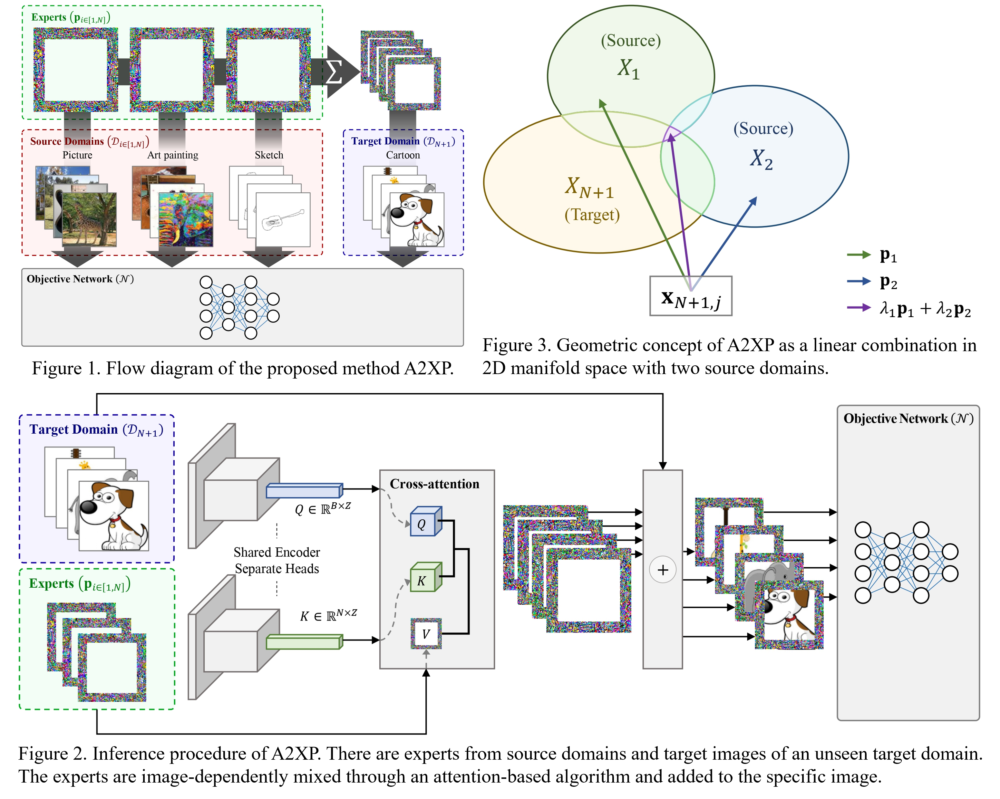

# A2XP: Towards Private Domain Generalization

The official PyTorch implementation of "A2XP: Towards Private Domain Generalization".

## Summary

### Abstract

> Deep Neural Networks (DNNs) have become pivotal in various fields, especially in computer vision, outperforming previous methodologies. A critical challenge in their deployment is the bias inherent in data across different domains, such as image style, and environmental conditions, leading to domain gaps. This necessitates techniques for learning general representations from biased training data, known as domain generalization. This paper presents Attend to eXpert Prompts (A2XP), a novel approach for domain generalization that preserves the privacy and integrity of the network architecture. A2XP consists of two phases: Expert Adaptation and Domain Generalization. In the first phase, prompts for each source domain are optimized to guide the model towards the optimal direction. In the second phase, two embedder networks are trained to effectively amalgamate these expert prompts, aiming for an optimal output. Our extensive experiments demonstrate that A2XP achieves state-of-the-art results over existing non-private domain generalization methods. The experimental results validate that the proposed approach not only tackles the domain generalization challenge in DNNs but also offers a privacy-preserving, efficient solution to the broader field of computer vision.

### Figures



## Environment

### Specification

This implementation was tested on Ubuntu 18.04 environment. 
The detailed specification is as follows:
1. Hardware Environment
   - Intel Xeon Gold 6226R 2.90GHz
   - NVIDIA RTX 3090
2. Software Environment
   - Ubuntu 18.04.6 LTS
   - Python 3.11.5
   - PyTorch 2.0.1

### Setup

Please run the command below to reproduce our `Anaconda3` virtual environment. 

``` bash
$ conda env create --file environment.yaml
```

## Experimentation

### Expert Adaptation

You can train expert prompts by running

``` bash
$ python train_expert.py --dataset pacs --domain p                     --gpu 0  # Gaussian initialization
$ python train_expert.py --dataset pacs --domain p --zero-init         --gpu 1  # Zero initialization
$ python train_expert.py --dataset pacs --domain p --unif-init         --gpu 2  # Uniform initialization
$ python train_expert.py --dataset pacs --domain p --meta-init wo-head --gpu 3  # Meta initialization
```

We included our expert prompts in `log/experts` directory. 

And if you run `train_expert.py`, it will overwrite the experts that we provided.

You can specify the objective network using `--model` keyword parameter.
``` bash
$ python train_expert.py --model vit_base_patch16_clip_224.openai --dataset pacs --domain p --gpu 0
```
`timm` models are basically supported and CLIP-pretrained ResNet50 and ImageNet-1K-pretrained ViT-Base are also supported as `resnet50.clip` and `vit_base_patch16.tv_in1k` respectively.

### Attention-based Generalization

The attention-based generalization step of A2XP can be performed by running code below.

```bash
$ python train.py --dataset pacs --target p            --use-kld --norm-experts --use-tanh --tag __default/00 --gpu 0
$ python train.py --dataset pacs --target p --use-zero --use-kld --norm-experts --use-tanh --tag __default/00 --gpu 1
$ python train.py --dataset pacs --target p --use-unif --use-kld --norm-experts --use-tanh --tag __default/00 --gpu 2
$ python train.py --dataset pacs --target p --use-meta --use-kld --norm-experts --use-tanh --tag __default/00 --gpu 3
```

You can fix the random seed by specifying `--seed` argument. 

```bash
$ python train.py --dataset pacs --target p --use-kld --norm-experts --use-tanh --tag __default/00 --gpu 0 --seed 101
```

The checkpoints and performance will be recorded in python `dict` type in `log/{model}_{domain}/{domain}/{tag}/ckpt.pt` file.

The dictionary follows below structure.

```python
dict(
    cfg             = argparse_namespace,
    epoch           = best_epoch,
    accuracy        = best_accuracy,
    lr_list         = lr_list_across_epochs,
    loss_list       = loss_list_across_epochs,
    accuracy_list   = accuracy_list_across_epochs,
    best_state_dict = (objective_net_state_dict, prompter_state_dict),
    last_state_dict = (objective_net_state_dict, prompter_state_dict),
)
```

## Contact

For any questions, discussions, and proposals, please contact us at `geunhyeok@khu.ac.kr`. 

## Citation

Please consider citing this work if you use our code in your research:
```
@article{yu2023a2xp,
   title={A2XP: Towards Private Domain Generalization},
   author={Yu, Geunhyeok and Hwang, Hyoseok},
   journal={arXiv preprint arXiv:2311.10339},
   year={2023}
}
```
